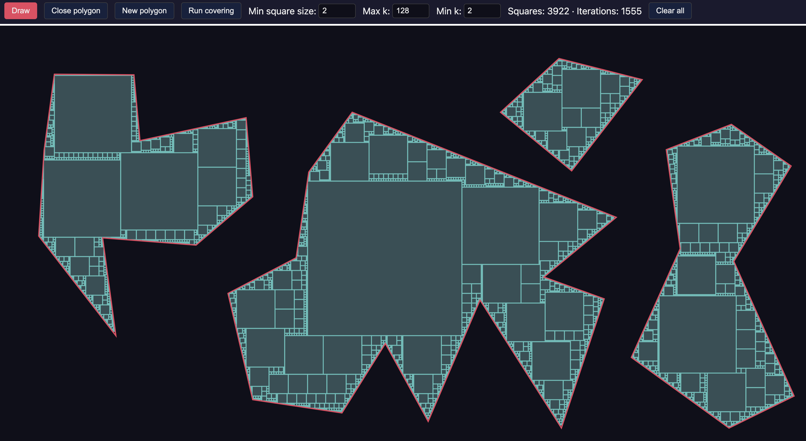

# Poly — Polygon to Rectangles

A web app that draws polygons and covers their interior with a minimal set of axis-aligned squares. You draw one or more polygons, then run a covering algorithm that fills them with a grid of small squares and merges adjacent blocks into larger squares to reduce the total count.



## What it does

- **Draw polygons** — Add vertices by clicking; close a polygon by clicking near the first point or double-clicking.
- **Union** — Multiple polygons are combined (union) before covering, so overlapping or separate shapes become one region (with holes if needed).
- **Covering** — The app fills the region with a grid of squares (smallest side = *min square size*), then repeatedly merges adjacent *k×k* blocks into single larger squares. Merge sizes *k* are tried by halving from *max k* down to *min k* (e.g. 128, 64, 32, … 2). Larger *max k* gives fewer, bigger squares but more work per step.
- **Animation** — The covering runs in steps so you see the grid appear and then blocks merge (or run to completion without animation).

## Run it

**Prerequisites:** Node.js and npm.

```bash
npm install
npm run dev
```

Open the URL shown (usually `http://localhost:5173`) in a browser.

**Production build:**

```bash
npm run build
npm run preview
```

## Interface

The app has three areas:

- **Header (toolbar)** — Icon buttons for all actions. Hover any button for a tooltip (and shortcut if applicable). Buttons: Draw, Close polygon, Undo, Redo, New polygon, Delete, Edit, Run covering, Export dropdown, Samples dropdown, Import, Paste, Reset zoom, Clear all, Help.
- **Canvas** — The main drawing area between header and footer. Zoom with the mouse wheel, pan by holding **Space** and dragging. **Home** fits the content to the visible canvas (90%).
- **Footer** — Covering options and live stats: min square size, snap to grid, max k, min k, speed (Slow / Normal / Fast), run without animation, square count, iterations, and polygon/covered area and efficiency.

## How to use

**Drawing and editing**

| Action | How |
|--------|-----|
| **Draw** | Click the Draw button (or press **D**). Clicks on the canvas add vertices; the button stays highlighted. |
| **Close polygon** | Click the Close button, or click near the first vertex, or double-click. |
| **New polygon** | Click New (or **N**) to keep the current polygon and start another (if it has ≥3 points). |
| **Select** | Click a closed polygon when not in draw mode to select it (highlighted). |
| **Edit** | With a polygon selected, click Edit or double-click to re-open it for editing (vertices). |
| **Delete** | With a polygon selected, click Delete or press **Delete** / **Backspace**. |
| **Undo / Redo** | **Ctrl+Z** / **Ctrl+Shift+Z** (or ⌘ on Mac) for last vertex or close. |

**Covering**

| Control | Action |
|--------|--------|
| **Run covering** | Click Run (or **R**) to run on all closed polygons (and current if ≥3 points). Button becomes Pause; **R** again pauses or resumes. |
| **Min square size** | Smallest grid cell side (1–200). Smaller = finer grid, more squares before merging. |
| **Snap to grid** | When drawing, snap new vertices to a grid with step = min square size. |
| **Max k** | Largest *k×k* merge block (2–1024). Merge tries k by halving: max k, max k/2, … down to min k. |
| **Min k** | Smallest *k* when halving (2–1024). |
| **Speed** | Animation step delay: Slow, Normal, or Fast. |
| **Run without animation** | Run covering to completion without stepping; Run button shows “Computing…” until done. |

**Export & import**

- **Export** (dropdown): Copy or download as Polygons (JSON), Rectangles (JSON), Rectangles (code), Rectangles (SVG), or Export all (JSON).
- **Samples**: Load a built-in sample polygon from the dropdown.
- **Import**: Choose a JSON file. **Paste**: Paste JSON from the clipboard.

**Viewport**

- **Zoom** — Mouse wheel (centered on cursor).
- **Pan** — Hold **Space** and drag.
- **Fit view** — **Home** (or Reset zoom button) fits content to 90% of the visible canvas between header and footer.

**Help** — Click **?** in the toolbar for the full keyboard shortcut list.

## Tech

- **Vite** — Dev server and build.
- **martinez-polygon-clipping** — Polygon union for combining multiple shapes and handling holes.
- **Canvas 2D** — Drawing and pan/zoom in world coordinates.
